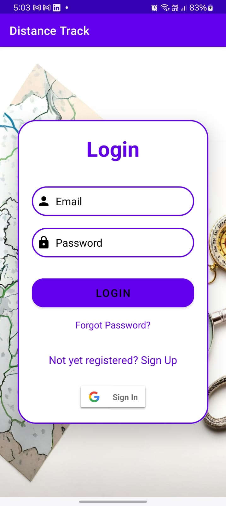
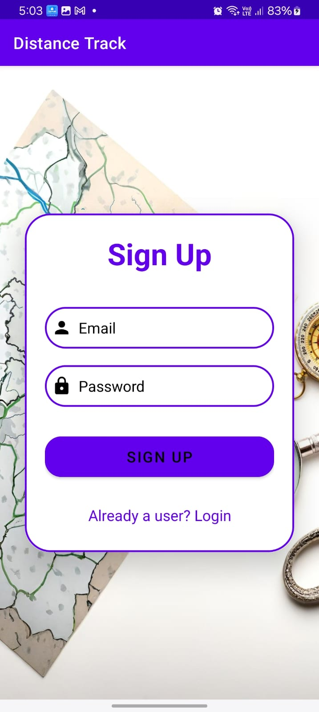
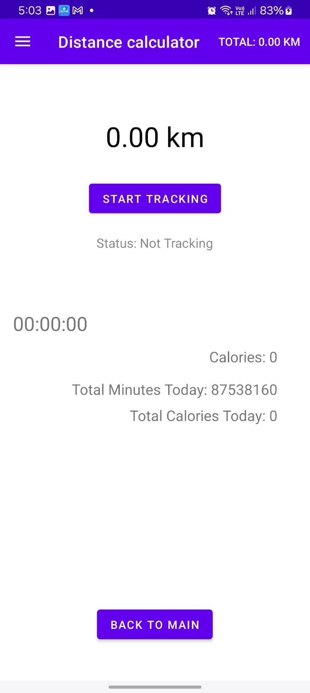
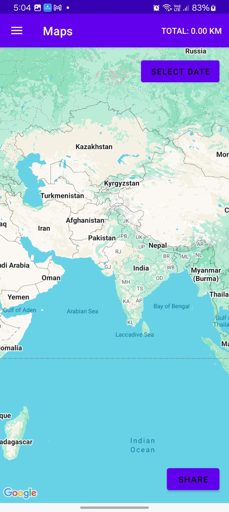
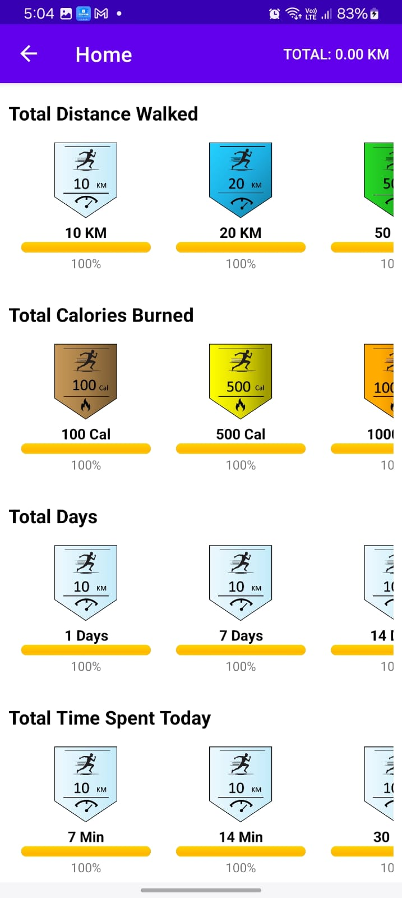
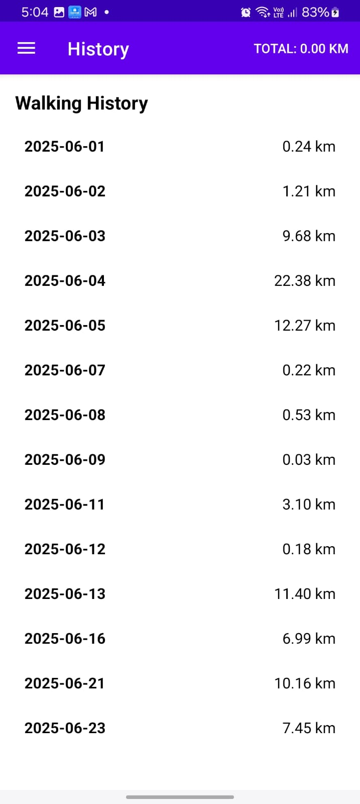

# 🚶‍♂️ Distance Tracker Android App

**Distance Tracker** is a fitness-focused Android app developed using **Android Studio**. It helps users monitor their walking or running activity through real-time tracking, interactive graphs, and visual route maps. The app supports **Dark Mode**, uses **Firebase Authentication** for secure login/signup, stores activity data using **Firebase Realtime Database**, and displays travel paths via the **Google Maps API**.

---

## 📱 Features

### 🔐 Authentication
- Firebase Email/Password Login & Signup
- Secure access with verification

### 🏠 Home Screen
- Central hub post-login to access all key features

### ⚖️ Unit Selection Fragment
- Choose between **Kilometers** or **Meters** for distance display
- Includes a **bar graph** showing daily distance:
  - **X-axis:** Dates
  - **Y-axis:** Distance (km/m)

### 📏 Distance Fragment
- Track distance in real-time during a walk/run session
- Displays:
  - Distance covered
  - Calories burned
  - Session duration
- Controls:
  - Start, Stop, Pause, Resume
  - Notification-based controls for tracking in the background

### 🗺️ Map Fragment
- Visualizes the route traveled using Google Maps
- Allows date selection to view past travel paths

### 🏆 Achievements Fragment
- Displays earned badges based on activity milestones:
  - Total Distance Walked
  - Total Calories Burned
  - Total Days Active
  - Total Time Spent
  - Weekly/Monthly/Yearly milestones

### 📅 History Fragment
- Lists daily distance logs with per-day distance walked

### 🌙 Dark Mode
- Fully compatible with Android’s dark theme

---

## 📸 Screenshots


### 🔄 App Flowchart


### 🔐 Login Screen


### 🆕 Signup Screen


### 🏠 Home Screen


### ⚖️ Unit Selection Fragment


### 📏 Distance Fragment


### 🗺️ Map Fragment


### 🏆 Achievements Fragment


### 📅 History Fragment



---

## 🧑‍💻 Tech Stack

- **Language:** Java (or Kotlin)
- **IDE:** Android Studio
- **Firebase Services:**
  - Authentication
  - Realtime Database
- **Google Maps API:** For path tracking
- **MPAndroidChart** (or similar) for distance graphs

---

## 🚀 Getting Started

### Prerequisites

- Android Studio installed
- Firebase Project with:
  - Email/Password Authentication
  - Realtime Database enabled
- Google Maps API Key from Google Cloud Console

### Installation

1. **Clone the repository**
   ```bash
   git clone https://github.com/cra-arun/distance-tracker.git
   ```

2. **Open in Android Studio**

3. **Configure Firebase**
   - Download `google-services.json` from Firebase Console
   - Place it inside the `app/` folder

4. **Enable Maps**
   - Add your Maps API key to `AndroidManifest.xml`:
     ```xml
     <meta-data
         android:name="com.google.android.geo.API_KEY"
         android:value="************"/>
     ```

5. **Build and Run**

---

## 📂 Project Structure

```
DistanceTracker/
├── activities/
├── fragments/
│   ├── UnitSelectionFragment
│   ├── DistanceFragment
│   ├── MapFragment
│   ├── AchievementsFragment
│   └── HistoryFragment
├── models/
├── utils/
├── res/
│   ├── layout/
│   ├── drawable/
│   └── values/
```

---

## 🎯 Future Enhancements

- Integration with smartwatches or fitness bands
- Step counting feature
- Advanced weekly/monthly analytics
- Social sharing of badges and stats

---

## 📃 License

This project is licensed under the MIT License – see the [LICENSE](LICENSE) file for details.

---

> Made with 💙 in Android Studio using Firebase & Google Maps

